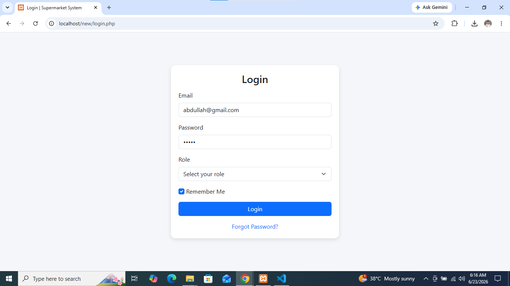
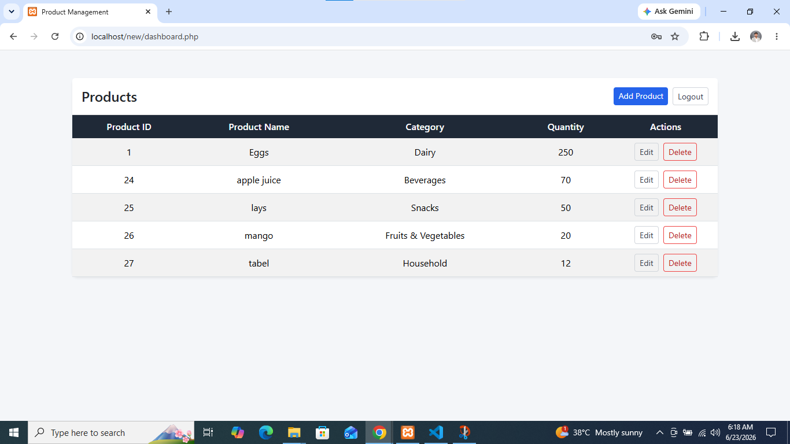
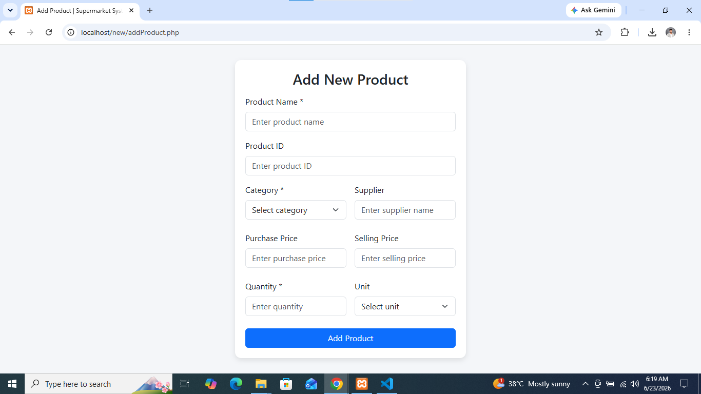

# Supermarket Product Management System

A PHP-based product management system for a supermarket or small retail store. This project demonstrates a basic login workflow, protected dashboard access, and CRUD operations for products using PHP, MySQL, and Bootstrap.

## Project Overview

This application allows authorized users to log in and manage products in a supermarket inventory. Authorized person can view product records, add new products, edit existing products, and remove products from the database.

The UI is built using Bootstrap for responsive styling, while backend logic is implemented with procedural PHP and MySQL database connectivity.

Must Read `Setup Instructions` and `Usage` before running.

---

##  Screenshots

---

## Key Features

- User login page with email and password input
- Session-based access control for dashboard and product management pages
- Product listing on the dashboard with edit and delete actions
- Add product page for inserting new inventory items
- Edit product page prefilled with existing product data
- Delete product support via product ID
- Logout functionality to end user sessions

## Technologies Used

- PHP (procedural)
- MySQL
- HTML5
- CSS3
- Bootstrap 5 (CDN)
- Apache / XAMPP (recommended local environment)

## File Structure

- `login.php` — Login form and session entry point
- `process.php` — Authentication logic and session/cookie handling
- `dashboard.php` — Product dashboard with list, edit, and delete links
- `addProduct.php` — Form to add a new product or edit an existing product
- `addProductToDB.php` — Inserts a new product into the database
- `editProduct.php` — Updates existing product data in the database
- `deleteProduct.php` — Deletes a product from the database
- `logout.php` — Ends the user session and returns to login
- `dbConnect.php` — Shared database connection script
- `style.css` — Custom form and container styles

## Database Requirements

The application uses a MySQL database named `mydb`.
A ready-to-import SQL export is included at `DataBase/mydb.sql`.

### `users`
- `email` (VARCHAR)
- `password` (VARCHAR)

### `products`
- `id` (INT, primary key)
- `productName` (VARCHAR)
- `category` (VARCHAR)
- `quantity` (INT)

The provided SQL file will create the database schema and insert a default user automatically.

## Setup Instructions

1. Install XAMPP or another PHP/MySQL development environment.
2. Place the project folder in the web server document root (for example, `C:\xampp\htdocs\inventory`).
3. Start Apache and MySQL services.
4. Import `DataBase/mydb.sql` into MySQL to create the `mydb` database, tables, and a default user.
5. Update `dbConnect.php` if your database credentials differ from the defaults:
   - Host: `localhost`
   - Username: `root`
   - Password: `` (empty)
   - Database: `mydb`
6. Open `http://localhost/new/login.php` in your browser.

## Usage

- Log in using the default credentials from the imported SQL file:
  - Email: `abdullah@gmail.com`
  - Password: `12345`
- After successful authentication, you will be redirected to `dashboard.php`.
- Add or edit products from the dashboard.
- Use the Logout button to end the session.

## Note
- The role selection field on the login page is present in the UI but not yet wired into authentication logic.
